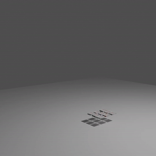

# blender-projects

## List of Projects
- Donut (Archived)
- Paper Simulation
- Isometric Room (Archived)
- Car Race (Archived)
- Pinic Table Animation (Archived)
- Shapeshifting Pots Animation (Archived)

### Donut 

This is my first blender project! The final animation is displayed below:

### Paper Simulation 

This project is an ongoing experimentation of playing around with papers. An animation that briefly exhibits my experimentation is below:

### Isometric Room 

This project involved learning more about basic blender operations and building out an interesting scene in an isometric style. The animation showcasing the scene is shown below:

### Car Race

This project involved learning more about motion and animation techniques to create a "seamless" transition between loops. The animation showcasing the scene is shown below:

### Pinic Table

This project involved learning more about stylizing animation for still objects. The animation showcasing the scene is shown below:

### Shapeshifting Pots

This projected involved learning more about shapekeys and their usefullness in animation. The animation showcasing the scene is shown below:

